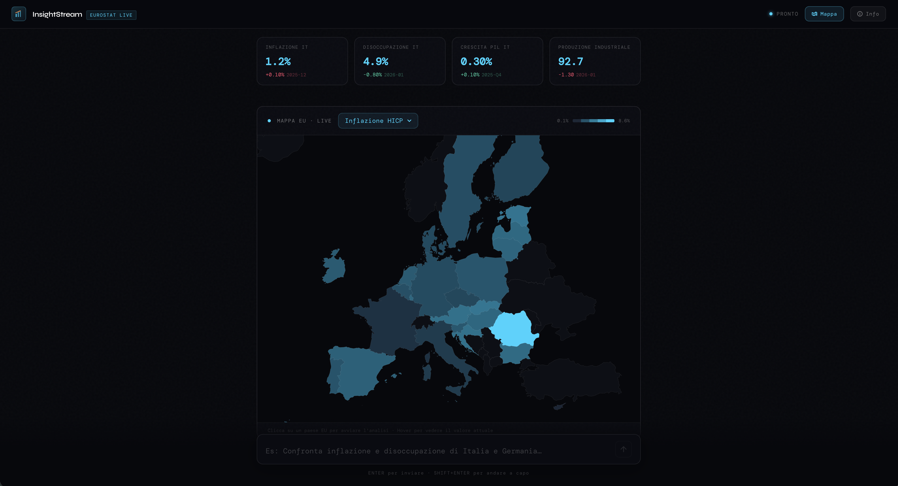

<div align="center">

# InsightStream

**European Economic Intelligence Dashboard**

Real-time macroeconomic analysis powered by Eurostat live data and generative AI.
Ask questions in natural language. Get interactive charts. Explore the EU economy.

[](https://nextjs.org)
[](https://typescriptlang.org)
[](https://sdk.vercel.ai)
[](https://ec.europa.eu/eurostat)
[](https://vitest.dev)
[](LICENSE)

**[→ Live Demo](https://insightstream.edoedoedo.it)**



</div>

---

## What is InsightStream?

InsightStream is a professional-grade dashboard that combines **live Eurostat data** with **agentic AI** to make European macroeconomic analysis accessible to anyone — without requiring statistical or technical expertise.

Type a question in Italian or English. The AI autonomously calls the Eurostat REST API, retrieves verified data, renders an interactive time-series chart, and delivers a structured analysis. No hallucinated figures — every insight is grounded in real data retrieved at query time.

---

## Architecture Overview

```
┌─────────────────────────────────────────────────────────────┐
│                        Browser (Next.js)                     │
│                                                             │
│  page.tsx ──── useChat (Vercel AI SDK) ──► /api/chat        │
│     │                                          │            │
│  EuroMap.tsx ◄── map↔chat sync           streamText()       │
│  EconomicChart.tsx ◄── toolInvocations        │            │
│  SuggestionChips.tsx ◄── parsed JSON     getEurostatData()  │
│                                                │            │
│                                         /api/eurostat       │
│                                                │            │
│                                    Eurostat Statistics API  │
│                                  (ec.europa.eu/eurostat)    │
└─────────────────────────────────────────────────────────────┘
```

### Data Flow

```
User prompt
    │
    ▼
AI (Groq / Mistral / Gemini)
    │  decides to call tool
    ▼
getEurostatData(indicator, countries[], periods)
    │
    ▼
/api/eurostat proxy ──► Eurostat JSON-stat API
    │
    ▼
JSON-stat parser (multi-dimension stride calculation)
    │  frequency-aware period conversion
    ▼
EuroRecord[] — normalized, validated with Zod
    │
    ├──► EconomicChart (Recharts multi-line time series)
    ├──► SuggestionChips (3 contextual follow-up prompts)
    └──► EuroMap (D3 choropleth — highlighted countries)
```

### Key Architectural Decisions

| Decision                                | Rationale                                                                                                                                                |
| --------------------------------------- | -------------------------------------------------------------------------------------------------------------------------------------------------------- |
| **Tool Calling over context injection** | Dataset too large for prompt context. Tool calling fetches only required data per query, keeping token usage minimal.                                    |
| **Server-side Eurostat proxy**          | Avoids CORS restrictions. Enables Next.js `revalidate` caching at the edge. Keeps API logic server-side.                                                 |
| **Generative UI via `toolInvocations`** | Charts render as native React components mid-stream, not as static images. State is preserved across re-renders via `React.memo`.                        |
| **JSON-stat stride parser**             | Eurostat returns multi-dimensional data cubes. Custom stride-based index calculation handles arbitrary dimension ordering without hardcoded assumptions. |
| **Frequency-aware period conversion**   | `lastTimePeriod=48` means different things for monthly vs semi-annual data. `monthsToObservations()` normalizes user input to correct API observations.  |
| **Multi-provider model registry**       | Single `models.ts` file drives both the UI switcher and backend routing. Adding a new provider = 1 entry in the registry + 1 line in `resolveModel()`.   |
| **Modular component architecture**      | `page.tsx` orchestrates; each UI concern lives in a dedicated file. Chat input uses `forwardRef` for programmatic submit — no DOM queries.                |
| **Fallback suggestion chips**           | When AI stream is truncated (rate limit), chips are derived from tool result data so the user is never left at a dead end.                                |

---

## Tech Stack

| Layer                | Technology                                                                                          |
| -------------------- | --------------------------------------------------------------------------------------------------- |
| **Framework**        | Next.js 15.5 (App Router) + TypeScript strict mode                                                  |
| **AI Orchestration** | Vercel AI SDK v4 — `streamText`, Tool Calling, `toDataStreamResponse`                               |
| **AI Providers**     | Groq (llama-3.3-70b, llama-3.1-8b) · Mistral AI (mistral-small) · Google AI (gemini-2.0-flash-lite) |
| **Data Source**      | Eurostat Statistics REST API — JSON-stat format                                                     |
| **Data Validation**  | Zod schemas for all API responses and tool parameters                                               |
| **Visualization**    | Recharts (time series) · D3-geo (EU choropleth map)                                                 |
| **UI**               | Tailwind CSS · Framer Motion · DM Mono + Syne (next/font)                                           |
| **Export**           | jsPDF + html2canvas                                                                                 |
| **Testing**          | Vitest (40 unit tests covering parsers, validators, and formatters)                                  |

---

## Quick Start

```bash
# 1. Clone and install
git clone https://github.com/your-username/insightstream.git
cd insightstream
npm install

# 2. Configure environment
cp .env.example .env.local
# Edit .env.local — at minimum, add GROQ_API_KEY

# 3. Run tests
npm test

# 4. Run development server
npm run dev
# Open http://localhost:3000
```

---

## Environment Variables

| Variable                       | Required    | Provider                                           | Free Tier                   |
| ------------------------------ | ----------- | -------------------------------------------------- | --------------------------- |
| `GROQ_API_KEY`                 | ✅ Required | [console.groq.com](https://console.groq.com)       | 30 req/min · 14,400 req/day |
| `MISTRAL_API_KEY`              | Optional    | [console.mistral.ai](https://console.mistral.ai)   | 1B tokens/month             |
| `GOOGLE_GENERATIVE_AI_API_KEY` | Optional    | [aistudio.google.com](https://aistudio.google.com) | 15 req/min                  |

All AI providers are **free tier** — no credit card required for basic usage. Eurostat requires no API key.

---

## File Structure

```
insightstream/
├── app/
│   ├── api/
│   │   ├── chat/
│   │   │   └── route.ts              # AI backend: model routing, Tool Calling, streaming
│   │   └── eurostat/
│   │       └── route.ts              # Eurostat proxy: CORS bypass, edge caching
│   ├── components/
│   │   ├── ai/
│   │   │   ├── EconomicChart.tsx      # Generative UI: multi-country time series (Recharts)
│   │   │   ├── EuroMap.tsx            # Interactive EU choropleth map (D3-geo + React SVG)
│   │   │   └── EurostatChart.tsx      # Shared primitives: Skeleton + ErrorBoundary
│   │   ├── chat/
│   │   │   ├── ChatInput.tsx          # Bottom input bar with forwardRef (programmatic submit)
│   │   │   ├── HeroMetrics.tsx        # Top KPI cards (4 Italian indicators)
│   │   │   └── MessageBubble.tsx      # Chat bubbles, tool rendering, fallback chips
│   │   ├── onboarding/
│   │   │   └── OnboardingModal.tsx    # First-visit 4-slide onboarding flow
│   │   └── ui/
│   │       ├── ExportButton.tsx       # PDF export (jspdf + html2canvas)
│   │       ├── InfoPanel.tsx          # Slide-in panel: About / Data sources / Model switcher
│   │       └── SuggestionChips.tsx    # Contextual follow-up chips (parsed from AI stream)
│   ├── lib/
│   │   └── design-tokens.ts          # Centralized color and design token constants
│   ├── utils/
│   │   ├── eurostat-client.ts         # JSON-stat parser, 10 indicators, in-memory cache
│   │   └── models.ts                  # AI model registry (single source of truth)
│   ├── globals.css
│   ├── layout.tsx
│   └── page.tsx                       # Main dashboard: orchestration, layout, state wiring
├── __tests__/
│   ├── eurostat-client.test.ts        # 30 tests: parser, validator, formatter, period converter
│   └── suggestion-parser.test.ts      # 11 tests: fenced blocks, raw JSON, fallback, edge cases
├── .env.example
├── vitest.config.ts
├── next.config.ts
├── tailwind.config.ts
└── tsconfig.json
```

---

## Testing

The project includes a comprehensive test suite powered by **Vitest** covering all critical data processing logic.

```bash
npm test              # Run all 40 tests
npm run test:watch    # Watch mode during development
```

### Test Coverage

| Module                  | Tests | What's covered                                                                                       |
| ----------------------- | ----- | ---------------------------------------------------------------------------------------------------- |
| `eurostat-client.ts`    | 29    | `parseJsonStat` (multi-dim cubes, EU27 aggregates, null handling), `monthsToObservations`, `formatPeriod`, `EuroRecordSchema` validation |
| `SuggestionChips.tsx`   | 11    | `parseSuggestions` (fenced blocks, raw JSON, partial/malformed JSON, fallback priority, edge cases)  |

---

## Available Indicators

10 Eurostat indicators, each with dedicated configuration (dataset code, extra params, frequency, unit, default history window):

| Indicator                    | Eurostat Dataset | Frequency   | Unit           | Default history |
| ---------------------------- | ---------------- | ----------- | -------------- | --------------- |
| Inflation (HICP)             | `prc_hicp_manr`  | Monthly     | % YoY          | 24 months       |
| Unemployment rate            | `une_rt_m`       | Monthly     | % active pop   | 24 months       |
| Household electricity prices | `nrg_pc_204`     | Semi-annual | €/kWh          | 10 years        |
| GDP growth (real)            | `namq_10_gdp`    | Quarterly   | % QoQ          | 24 months       |
| Consumer confidence          | `ei_bsco_m`      | Monthly     | Balance index  | 24 months       |
| Residential house prices     | `prc_hpi_q`      | Quarterly   | Index 2015=100 | 10 years        |
| NEET youth (15–29)           | `edat_lfse_20`   | Annual      | %              | 10 years        |
| Renewable energy share       | `nrg_ind_ren`    | Annual      | %              | 20 years        |
| Public debt                  | `gov_10dd_edpt1` | Annual      | % of GDP       | 10 years        |
| Industrial production        | `sts_inpr_m`     | Monthly     | Index 2021=100 | 24 months       |

### Adding a New Indicator

1. Add an entry to `INDICATORS` in `app/utils/eurostat-client.ts`
2. Add it to the `EuroIndicatorSchema` Zod enum (same file)
3. Add it to the `z.enum()` in `app/api/chat/route.ts`
4. Update the system prompt indicator list
5. No frontend changes needed — `EconomicChart` and `EuroMap` are fully data-driven

---

## AI Models

The model registry (`app/utils/models.ts`) is the single source of truth. Each entry drives both the InfoPanel UI and the backend `resolveModel()` function.

| Model                     | Provider   | Best for                                                         |
| ------------------------- | ---------- | ---------------------------------------------------------------- |
| `llama-3.3-70b-versatile` | Groq       | Default — best analysis quality, complex multi-indicator queries |
| `llama-3.1-8b-instant`    | Groq       | High-throughput sessions, simple queries, fastest response       |
| `mistral-small-latest`    | Mistral AI | European model, strong multilingual, 1B free tokens/month        |
| `gemini-2.0-flash-lite`   | Google AI  | Ultra-fast, good tool calling support                            |

> **Rate limits:** if one provider stops responding, the error message will suggest switching model from the ⓘ InfoPanel. Each provider has independent rate limits.

### Adding a New Model/Provider

```ts
// app/utils/models.ts — add one entry:
"openai/gpt-4o-mini": {
  name: "GPT-4o Mini", provider: "OpenAI",
  modelId: "gpt-4o-mini", color: "#10b981",
  description: "...", stats: [...], free: false,
  apiKeyEnv: "OPENAI_API_KEY",
}

// app/api/chat/route.ts — add one line:
if (modelId.startsWith("openai/")) return openai(config.modelId);
```

---

## Example Queries

```
# Single country, single indicator
"Analizza l'inflazione italiana negli ultimi 24 mesi"

# Multi-country comparison
"Confronta disoccupazione di Italia, Germania e Spagna"

# Multi-indicator analysis (triggers sequential tool calls)
"Dammi un quadro completo dell'economia italiana: inflazione, PIL e debito pubblico"

# Historical deep-dive (uses indicator defaultPeriods)
"Mostrami l'evoluzione dei prezzi degli immobili in Italia dal 2015"

# Industrial analysis
"Confronta la produzione industriale di Italia, Germania e Francia"

# EU benchmark
"Come si posiziona l'Italia rispetto alla media EU27 su debito pubblico e NEET?"

# Resilience comparison
"Confronta la resilienza economica di Italia e Spagna: inflazione, disoccupazione e PIL"
```

---

## Caching Strategy

```
Request → getCacheKey(indicator, countries[], periods)
               │
               ├── HIT  (< 1 hour old) → return cached EuroRecord[]
               │
               └── MISS → fetch Eurostat API
                              │
                              └── store in Map<string, CacheEntry>
                                  TTL: 3600 seconds
```

Cache is in-memory per server instance. On Vercel, Next.js `revalidate: 3600` provides additional HTTP-level caching at the edge.

---

## Deployment

### Vercel (recommended)

```bash
# Install Vercel CLI
npm i -g vercel

# Deploy
vercel

# Set environment variables in Vercel dashboard:
# Settings → Environment Variables
# GROQ_API_KEY (required)
# MISTRAL_API_KEY (optional)
# GOOGLE_GENERATIVE_AI_API_KEY (optional)
```

### Custom domain

Add a `CNAME` record pointing to `cname.vercel-dns.com`, then add the domain in Vercel → Settings → Domains.

### Self-hosted

```bash
npm run build
npm start
# Requires Node.js 18+ and the environment variables set
```

---

## Development

```bash
npm run dev          # Start dev server (http://localhost:3000)
npm run build        # Production build + type check
npm run lint         # ESLint
npm test             # Run all 40 tests (Vitest)
npm run test:watch   # Watch mode
npm run type-check   # TypeScript strict check (no emit)
```

### Architecture Principles

- **No `any` types** — 100% TypeScript strict coverage
- **No mock data in production** — all data from live Eurostat API
- **Tool-first AI** — AI never answers data questions without calling a tool first (enforced via system prompt)
- **Error isolation** — every chart wrapped in `ErrorBoundary`; tool failures return empty records gracefully
- **Indicator-aware semantics** — delta colors account for direction (↑ unemployment = red, ↑ GDP = green)
- **Unit-aware formatting** — symbol units (%, €/kWh) attach directly; word units (indice, punti) are spaced or omitted on axes
- **Modular components** — `page.tsx` is an orchestrator (~500 lines); all UI concerns extracted to dedicated files
- **Graceful degradation** — rate limit errors suggest model switching; fallback chips generated from tool data when AI stream is cut
- **Tested core logic** — 40 unit tests covering JSON-stat parsing, Zod validation, period conversion, and suggestion extraction

---

## Data Attribution

All economic data is sourced from **[Eurostat](https://ec.europa.eu/eurostat)** — the Statistical Office of the European Union.

> Data is free to use and redistribute under [Eurostat's copyright policy](https://ec.europa.eu/eurostat/about-us/policies/copyright).
> Source: Eurostat (online data codes listed in indicators table above).

---

<div align="center">

Built with Next.js · Vercel AI SDK · Eurostat · Groq · Framer Motion

A project by [*~~EDOEDOEDO~~*](https://www.edoedoedo.it/)

</div>
